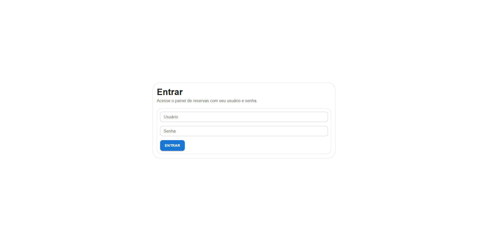
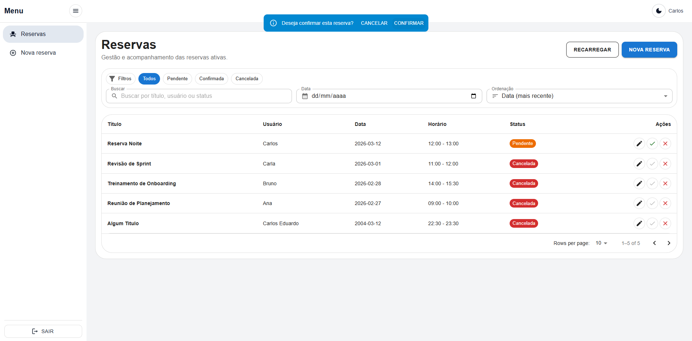
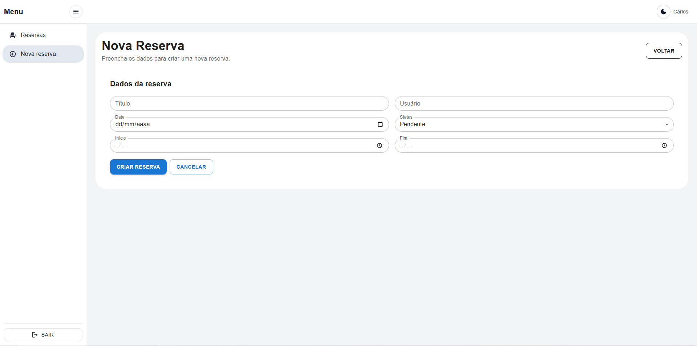
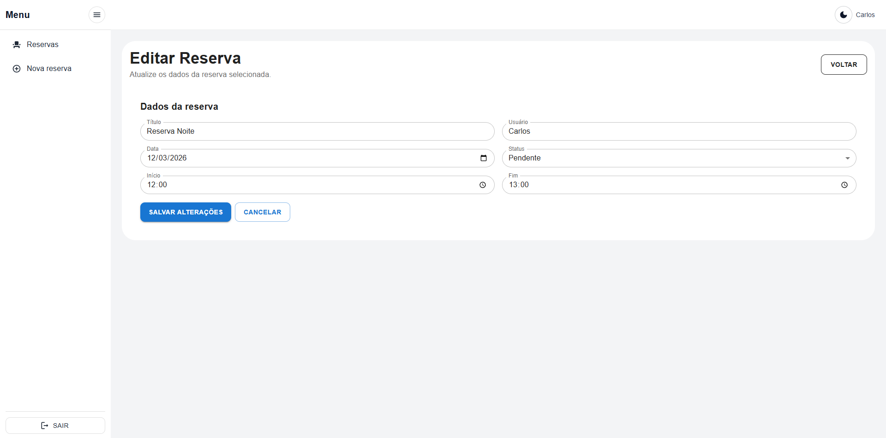

# React TS Reservation Dashboard

Dashboard de gerenciamento de reservas desenvolvido com React e TypeScript, com foco em arquitetura client-side, organização de código e experiência do usuário.  
O projeto é voltado para estudos, portfólio e demonstração de boas práticas em aplicações front-end modernas.  
Atende times que precisam de uma base escalável para CRUD com regras de negócio no cliente.  
Resolve cenários comuns de gestão de reservas com filtros, paginação, feedback visual e controle de status.  
Stack principal: React, TypeScript, Vite, Material UI, Axios e JSON Server.

---

## 🎯 Objetivo do Projeto

Simular um cenário real de aplicação corporativa front-end, aplicando padrões de arquitetura client-side e boas práticas de organização, com foco em escalabilidade, performance e previsibilidade de regras de negócio.

---

## 🚀 Tecnologias Utilizadas

- **React 19** + **TypeScript**
- **React Router DOM** (roteamento e rotas protegidas)
- **Axios** (cliente HTTP)
- **Material UI (MUI)** (UI e componentes visuais)
- **JSON Server** (API mock)
- **Vite** (build tool e dev server)
- **ESLint** (qualidade de código)
- **Prettier** (opcional para padronização de formatação)

---

## 🧠 Arquitetura e Design Patterns

1. **Container/Presentational Pattern** → páginas/containers em [`ReservationsPage`](src/pages/ReservationsPage.tsx) e componentes visuais reutilizáveis em [src/components](src/components)
2. **Custom Hooks** → encapsulamento de estado e lógica em [`useReservations`](src/hooks/useReservations.ts), [`useAuth`](src/hooks/useAuth.tsx), [`useThemeMode`](src/hooks/useThemeMode.tsx), [`useDebounce`](src/hooks/useDebounce.ts)
3. **Service Layer** → isolamento das chamadas HTTP em [`reservationService`](src/services/reservationService.ts)
4. **Adapter** → padronização entre DTO e domínio em [`fromDTO`](src/adapters/reservationAdapter.ts), [`toCreateDTO`](src/adapters/reservationAdapter.ts), [`toUpdateDTO`](src/adapters/reservationAdapter.ts)
5. **Strategy** → composição dinâmica de filtros em [`applyFilters`](src/utils/filters/applyFilters.ts), [`filterByStatus`](src/utils/filters/filterByStatus.ts), [`filterByDate`](src/utils/filters/filterByDate.ts), [`filterByText`](src/utils/filters/filterByText.ts)
6. **Mini State Machine** → regras de transição de status em [`canTransition`](src/utils/statusMachine.ts) e [`getAllowedTransitions`](src/utils/statusMachine.ts)

---

## 📂 Estrutura de Pastas

```txt
src/
 ├── pages/
 ├── components/
 ├── hooks/
 ├── services/
 ├── adapters/
 ├── models/
 ├── routes/
 ├── utils/
```

---

## ⚙️ Como Rodar o Projeto

```bash
# instalar dependências
npm install

# rodar frontend + API mock (concurrently)
npm run start
```

Opcionalmente, em terminais separados:

```bash
# frontend
npm run start

# apenas API mock
npm run mock:server
```

Build de produção:

```bash
npm run build
npm run preview
```

---

## ✨ Funcionalidades

- Autenticação simulada
- Rotas protegidas
- CRUD de reservas
- Filtros dinâmicos
- Paginação
- Alternância de tema (Dark/Light)
- Feedback visual (toast, skeleton, estados de loading/erro/vazio)
- Controle de transição de status com validação de regras

---

## 📈 Diferenciais Técnicos

- Organização arquitetural voltada para escalabilidade
- Separação clara entre UI, lógica e domínio
- Otimizações com `useMemo`, `useCallback` e `React.memo`
- Aplicação prática de padrões de projeto no front-end
- Tipagem forte ponta a ponta (domínio + DTO + formulários)

---

## 📷 Screenshots

> Substitua pelas imagens reais do projeto.






---

## ✅ Deploy

Vercel (exemplo):  
🔗 https://seu-projeto.vercel.app

---

## 🏗️ Visão Arquitetural

O projeto foi estruturado priorizando separação de responsabilidades, previsibilidade de regras de negócio e facilidade de manutenção.  
As decisões arquiteturais foram tomadas visando simular um ambiente corporativo real, onde escalabilidade e clareza estrutural são essenciais.

---

## 🔮 Próximas Evoluções

- Integração com backend real
- Testes unitários com Jest + Testing Library
- Controle de permissões por perfil de usuário
- Paginação server-side
- Implementação de cache com React Query